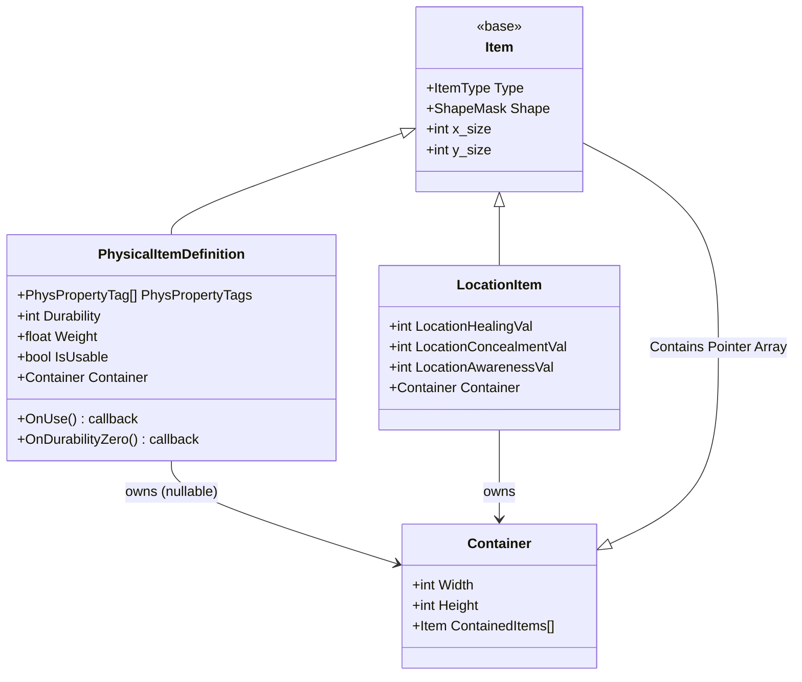
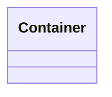

# Inventory Design

## Items

```mermaid
classDiagram
    class Item {
        <<base>>
        +ItemType Type
        +ShapeMask Shape
        +int x_size
        +int y_size
    }

    class PhysicalItemDefinition {
        +PhysPropertyTag[] PhysPropertyTags
        +int Durability
        +float Weight
        +bool IsUsable
        +Container Container
        +OnUse() callback
        +OnDurabilityZero() callback
    }

    class LocationItem {
        +int LocationHealingVal
        +int LocationConcealmentVal
        +int LocationAwarenessVal
        +Container Container
    }
    
    class Container {
        +int Width
        +int Height
        +Item ContainedItems[]
    }

    Item <|-- PhysicalItemDefinition
    Item <|-- LocationItem
    Container <|-- Item : Contains Pointer Array

    PhysicalItemDefinition --> Container : owns (nullable)
    LocationItem --> Container : owns


```

## Containers

Containers contain items. 

```mermaid
classDiagram

    class Container


```